# Contents

<!-- markdown-toc start - Don't edit this section. Run M-x markdown-toc-generate-toc again -->
**Table of Contents**

- [Contents](#contents)
- [Requirements](#requirements)
- [Installation](#installation)
- [Launch and basic setup](#launch-and-basic-setup)
- [Usage](#usage)
    - [Main interface](#main-interface)
    - [Track](#track)
    - [Tracks thumbnails](#tracks-thumbnails)
        - [Currently playing thumbnail](#currently-playing-thumbnail)
        - [Scenes](#scenes)
        - [Outputs](#outputs)
    - [Tracks arrangement](#tracks-arrangement)
    - [Scenes arrangement](#scenes-arrangement)
    - [Settings](#settings)
- [MIDI control](#midi-control)
- [DSP instance](#dsp-instance)

<!-- markdown-toc end -->

# Requirements
Purr-Data is shipped with a number of Pd externals without any need to install additional externals. A few abstractions have been found online (mostly on [forum.pdpatchrepo.info](https://forum.pdpatchrepo.info)) and put in the `tools/` subfolder of this project. Some of the non-vanilla externals used in this project are listed below (but it may not be exhaustive):
- moonlib (mknob,...)
- zexy (list2symbol,...)
- mrpeach (OSC messages)
- ...

This project has been developed on OpenSuse Leap (15.1, 15.2) and Debian (9, 10) using the following additional utilities:
- Bash for the scripts
- Alsa and Jack (optionally using a GUI like QJackctl)
- Non-Mixer, optionanlly using non-midi-mapper for sending MIDI signals to Non-Mixer instead of OSC messages
- Fluidsynth, used by `[fluid~]`, and some soundfonts
- and of course Purr-Data >= 2.13.0. The release 2.13.0 notably includes the support for Hex colors to be sent to objects with the `[color(` message, which is not supported in previous versions. However 2.13.0 broke `[mknob]`, which I replaced with sliders until it is fixed.

It has been developed and tested with the following physical devices:
- MIDI piano (88 keys), displayed as USB-MIDI in Jack
- MIDI controller with 25 keys, 8 knobs and 8 pads, displayed as MPKMini2 in Jack
- MIDI control surface with a matrix of 8\*8 buttons + one more column and one more row (that's 81 buttons) and 9 faders, displayed as APCmini in Jack
- an external USB microphone (not great, but that's what I got)
Other USB controllers should work in a similar fashion, but adjusting Pdlooper for them may not be very straightforward. This may be improved in future versions.

# Installation
The installation of Purr-Data is relatively straight-forward as explained [here](https://github.com/agraef/purr-data).

# Launch and basic setup
Pdlooper can be launched with the script `pdlooper.sh`.

This script will start:
1. a first instance of Purr-data for the audio backend, without a GUI, with DSP (sound) processing, and realtime priority, 2 MIDI input channels, 2 MIDI output channels, 2 audio inputs, and 16 audio outputs (`purr-data -rt -jack -unique -nogui dsp_main.pd`)
2. a second instance of Purr-data for the graphical interface, with the GUI enabled, without DSP processing, not realtime, 2 MIDI inputs, 2 MIDI outputs (`purr-data -nrt -jack -unique -nosound ui_main.pd`)

The first thing to do is to make sure that the MIDI and audio ports are connected in Jack, for example in QJackctl:
- internal audio capture or external microphone connected to the audio input of the DSP instance. If using a different soundcard (like in the case of my USB microphone), additional input devices can be added with `alsa_in hw:4 -j MyMic` (if the microphone's ID for Alsa is hw:4).
- MIDI keyboard connected to the first MIDI input of the DSP instance
- MIDI control surface connected to the first MIDI input of the UI instance, and to the first MIDI output of the UI instance (to light up the LEDs)
- MIDI keyboard with knobs connected to the second MIDI input of the UI instance

That's what it would look like in QJackctl graph view:
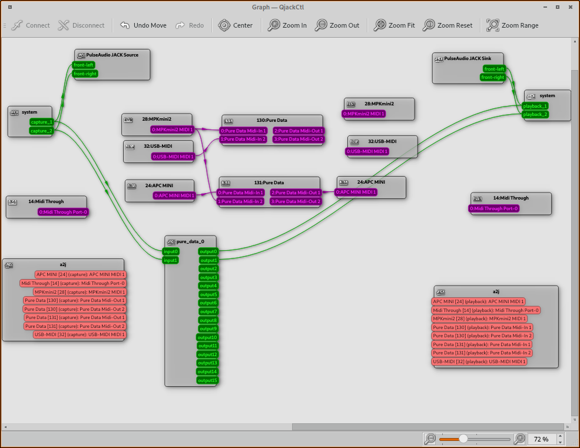

Unfortunately I haven't found a way yet to give each MIDI/Jack client a better name than "Pure Data" (except aliases for jack) so you may need to rely on the client ID to know which 'Pure Data' is the DSP and which is the UI instance.

- Optionally, Non-Mixer can be started from the subpatch `[pd settings]` in the main window, and automatically connected to Purr Data's audio outputs (only the DSP instance has audio outputs so that's easy). The 8 faders send their output to the Master fader, which is then connected to the main system output (internal or external soundcard with `alsa_out`).

It then looks like this in Qjackctl:
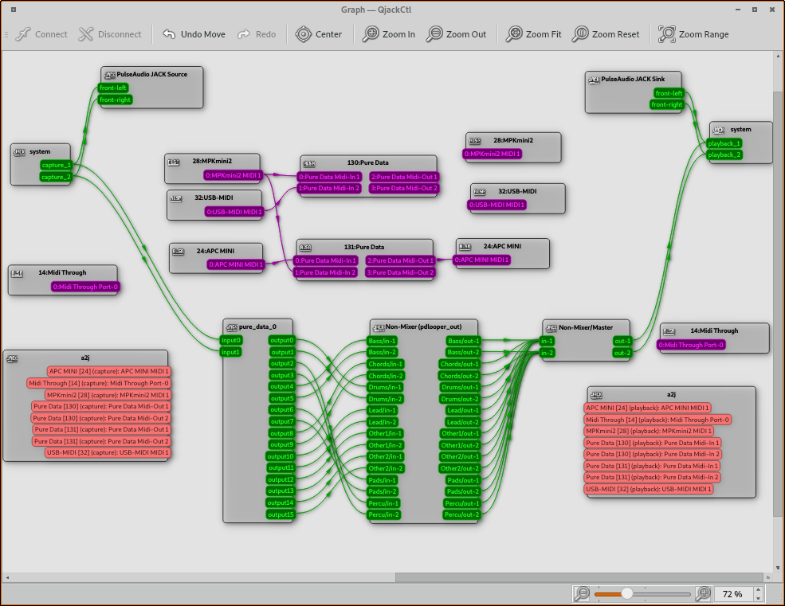

And Non-Mixer's default set up looks like this (here also with a x42 compressor plugin on the drums strip):

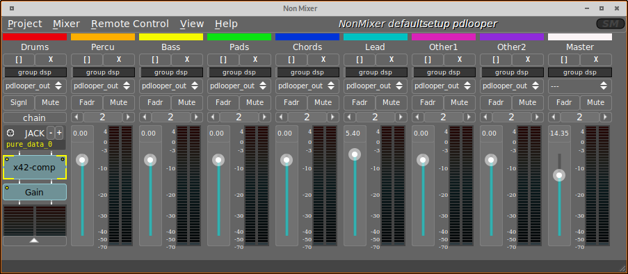

# Usage

Now that the devices are connected, we can look at Pdlooper's interface.

## Main interface

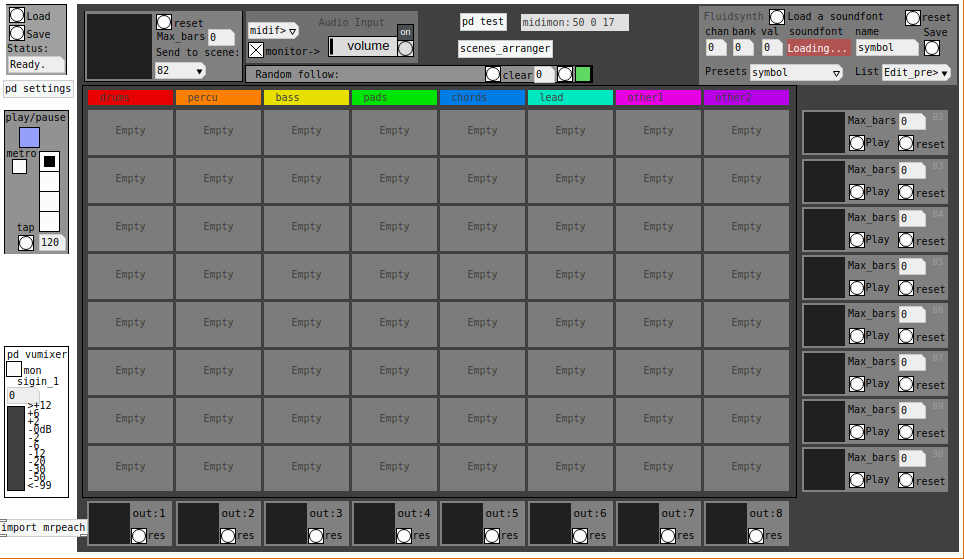

The main window presents the following main parts:
- The matrix of 8\*8 tracks, matching the 8\*8 buttons on the MIDI controller. At start they are empty. A new track can be created by clicking on an ampty slot, or by pressing the corresponding button on the MIDI controller. The track's interface is explained more in detail in [Track](#track).
- The bottom row of 8 widgets displays the tracks assigned to each of the 16 output channels, i.e. 8 stereo outputs, that are already connected with Non-Mixer.
- The right column of 8 widgets displays the scenes, i.e. groups of tracks to be started together at once.
- Metronome:
  - For now only 4 beats per bar, but it can be adjusted in the code.
  - Tap to redefine the tempo.
  - Enable or disable a click at each beat, sent to the first 2 audio outputs.
- Load/Save: Allows to save or load a session, consisting of one text file and a subfolder containing the WAV files for all tracks.
- Audio input: Choose between adc~ i.e. audio input in jack, or midifluid i.e. the buit-in Fluidsynth synthesizer. Activate monitoring qnd turn up the volume to hear the sound generated by fluidsynth. [This may be moved outside of Pdlooper in the future, or replaced by Qsynth or similar existing Fluidsynth interfaces.]
- VU meter: activate to check whether sound is received by Purr-Data, but deactivate it when not needed as it is quite heavy in CPU and OSC messages.
- Fluidsynth presets: see [Fluidsynth interface](#fluidsynth)
- Overview thumbnail of tracks currently playing: see [Thumbnail](#thumbnail)
- Tracks and scenes arrangement: TO DO

## Track
Each track contains one sample, that can be recorded, played, stopped using the interface or MIDI controls. Each track can be sent to a specific output (e.g. one of Non-Mixer's 8 stereo channels), but basic audio settings like Volume and Panning can be adjusted for every individual track. The tracks are numbered as on the APC Mini, with the track 0 in the bottom left corner, 7 in the bottom right, 56 in the top left and 63 in the top right corner.

Each track slot can have 3 different views:
- Empty slot

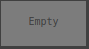

- Track main view

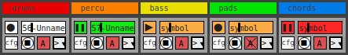

  - Each track can have 7 status:
    - 0  Empty, white background, i.e. no sample has been recorded yet.
    - 1  Playing, solid green background
    - 2  Playing in queue, blinking green background. The sample will be played at the start of the next bar.
    - 3  Recording, solid red background
    - 4  Recording in queue, blinking red background. The sample will be recorded starting from the next bar.
    - 5  Stopped, yellow background
    - 6  Stopped in queue, blinking yellow background. The sample will stop when it finished playing.
  - One Play/Rec/Pause button, changing status and color depending on the current status of the track. Stop, Rec or Pause will be activated only at the beginning of the next bar or the end of the sample.
  - Cfg button, to display the track's configuration panel
  - A `[hslider]` object showing the time progression of the track's sample, the label of the track, and the background color depending on the track's status
  - A Stop button to immediately stop the playback (without waiting for the end of the sample)
  - An Arm button to toggle sample recording even if a sample already exists on this track
  - A drop-down menu with additional functions:
    - Clear the track: This will delete the sample and free the track's slot.
    - TO DO: Cut/Copy the track to be pasted into a different, empty slot.

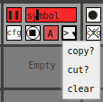

- Track configuration

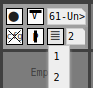

  - The Play/Rec/Pause button is still visible
  - The Cfg button is still visible to switch back to the track's main view
  - A knob (or slider) for the track's volume, independent from all other tracks
  - A knob (or slider) for the track's panning, independent from all other tracks
  - A field to edit the track's name (defaults to "xx-Unnamed" where xx is the number of the track from 0 to 63)
  - A value for the number of bars for this track, defaults to 2
  - A drop-down menu for the output channel for this track. Typically this should be the output corresponding to the column in which the track is, but it can be changed.

## Tracks thumbnails
### Currently playing thumbnail

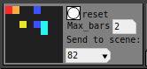

The big icon represents the tracks currently playing, each by a dot corresponding to the column they are in. This overview can be sent to a scene by selecting it in the dropdown menu (numbered from 82 to 89 as per the MIDI buttons on the controller, but this may change in the future).

### Scenes

***add picture***

When the thumbnail is sent to a scene, the corresponding widget in the 9th column on the right will display the same thumbnail. All tracks displayed on the thumbnail can be started simultaneously when the scene is triggered with the scene's Play button.

### Outputs

***add picture***

Similarly to the thumbnail above, this displays the existing tracks (not necessarily currently playing) assigned to each pair of outputs. This is updated whenever a track is moved to a different output using the track's configuration panel.

## Tracks arrangement
TO DO, not ready yet

## Scenes arrangement
TO DO, not ready yet

## Settings
The subpatch `[pd settings]` gathers multiple options and settings:

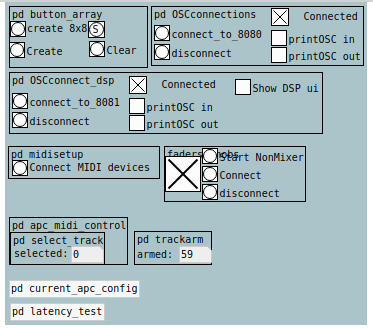

- `pd button_array` is used to create the UI's track matrix, and can be adjusted for the number of tracks, colors, size etc. though (for now) in a very non-user-friendly manner (basically modifying the hardcoded values).
- OSC connection for the DSP instance: the `[toggle]` indicates whether the DSP instance is connected to the UI instance (on UDP port 8081 by default)
- OSC connection for the UI instance: the `[toggle]` indicates whether the UI instance is connected to the DSP instance (on UDP port 8080 by default)
- Launch Non-Mixer with the standard setup, i.e. 8 stereo channels matching the 8 columns
- Auto-connect MIDI devices (probably only works on my current machine)
- MIDI bindings for APC controller

# MIDI control
This hasn't been tested with many various controllers, so it may not be very easy to adapt (yet). The following describes the default configuration with the devices mentioned in introduction.

To do

- Create tracks
- select
- config
- scenes
- outputs

# DSP instance

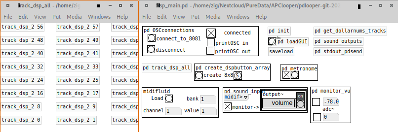

To do
