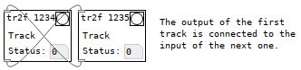

# Intro

Pdlooper is a looping software, typically used in live setups (but not only), with audio and MIDI support. It is written in [Pure Data](https://puredata.info/) - actually [Purr Data](https://github.com/agraef/purr-data), though I'm trying (not so successfully) to limit the number of externals used.   

I've been trying out open-source looping software for a while and could not find exactly what I was looking for. I have very little skills in lower-level, text-based programming languages so I didn't really have the possibility (unfortunately) to improve any of the tools I've tried, so I decided to build my own from scratch.  
Not sure whether this will actually be usable - especially in terms of real-time performance and sound quality - but it's at least fun to learn!

This has been developed and tested only on Debian 9.0 and OpenSuse 15.1-15.2 so far.

# Quick start
The current minor version, while not ready for production, is considered "jammable" i.e. it can be used for basic jamming (but there are still some visual and audio glitches).

Follow the instructions [here](https://github.com/agraef/purr-data) to install Purr-Data, copy this project's files, start jack, and run:

`./pdlooper.sh`

This is starting the DSP backend program, which will start a second instance of Purr-data with `-nrt -jack -unique -nosound ui_main.pd` to start the GUI in a separate thread, and the 2 instances will communicate *via* OSC messages.

There is a script to launch Non-Mixer and auto-connect Pdlooper to it (and send it OSC messages).

# Description
## Usage concept
Like the tools I was inspired by (see below), I intend to use Pdlooper in a modular setup, involving for example:
- physical MIDI controllers (control surface such as Akai APCs, Novation Launchpads, Ableton Push), including some knobs and faders
- MIDI keyboard(s)
- Software synthesizers (Fluidsynth, ZynAddSubFx/Zyn-Fusion, Helm, Calf suite's synths...) 
- a microphone and some real instruments
- Mixer (Non-Mixer, jack_mixer, or even Ardour)
- Lv2 plugin host for synths and effects (Carla, Ardour, Non-Mixer)

## Current features
- Set tempo by tapping
- Save and load the session (parameters in a text file, wav files are stored in a subfolder <name_of_text_file>\_files/)
- Audio input: selection between [adc~] (microphone) or an embedded fluidsynth input with [fluid~] and a preset system
- Audio tracks
  - Record audio tracks in stereo
  - Loop audio tracks
- Control tracks
  - groups/scenes of tracks to start at once
  - "Follow" and "Random Follow" modes to play a few given tracks in a sequence or randomly after one another
- configuration panel for every track:
  - select the output channels
  - change the name
  - adjust volume and panning
  - change the number of bars
  - clear the track
- Midi control
  - Controllable via a MIDI control surface (I use an AKAI APC Mini with 8\*8 buttons) including outgoing MIDI message to light up the controller's LEDs, including a pedal (CC#64)
  - include the controllers' knobs and faders in pdlooper's UI to send the signals to external mixers/plugins (rather than connecting the controllers to each mixer/effect host)
  - use some controls directly for the tracks' configuration inside pdlooper

That's what it currently looks like:

Follow and Random Follow:
 

Matrix thumbnail of all currently playing tracks, can be sent to scenes for arranging (and used to display the tracks in each output):

## Current issues
- There might still be some audio glitches
- A few unexpected behaviours of the UI

## Planned features
- More looping
  - tracks for midi controls
  - tracks for midi sequences?
  - one-shot mode for tracks that should be played only once
- Fancy stuff
  - include lv2 host with [lv2plugin~]?
  - arrange the tracks and scenes to start sequentially, while keeping the freedom to start/stop other tracks as wished
  - playlist?
  - support NSM protocol for use with Ray-Session?

## Inspiration
This looper is heavily inspired by Seq24/[Seq64](https://github.com/ahlstromcj/sequencer64) and [Luppp](http://openavproductions.com/luppp/)/[Loopp](https://git.netzspielplatz.de/soundship/loopp), and takes some ideas from [FreeWheeling](https://github.com/free-wheeling/freewheeling) and [SuperBoucle](https://github.com/Vampouille/superboucle), and probably others I don't remember (and some other well-known commercial software).
